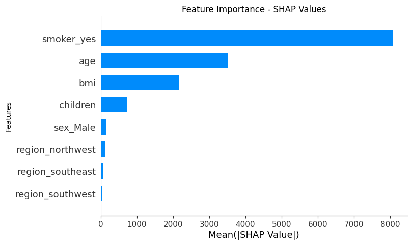

# Predicting Healthcare Costs with Explainable AI: Uncovering the Drivers of Insurance Costs

## Project Overview
This project aims to predict customer healthcare costs using machine learning and explainable AI to uncover the key drivers of insurance costs. The insights gained from this analysis will help tailor services and guide customers in planning their healthcare expenses more effectively.

## Dataset Summary
The dataset used for this project is `insurance.csv`, which contains information on health insurance customers and their healthcare costs.

### insurance.csv
| Column    | Data Type | Description                                                      |
|-----------|-----------|------------------------------------------------------------------|
| `age`     | int       | Age of the primary beneficiary.                                  |
| `sex`     | object    | Gender of the insurance contractor (male or female).             |
| `bmi`     | float     | Body mass index, a key indicator of body fat based on height and weight. |
| `children`| int       | Number of dependents covered by the insurance plan.              |
| `smoker`  | object    | Indicates whether the beneficiary smokes (yes or no).            |
| `region`  | object    | The beneficiary's residential area in the US, divided into four regions. |
| `charges` | float     | Individual medical costs billed by health insurance.             |

## Steps and Methodology
1. **Data Preparation**
   - Loaded the dataset using Pandas.
   - Explored the dataset to understand its structure and identify missing values.
   - Visualized the missing values using a heatmap and decided to drop rows with missing values.

2. **Feature Engineering**
   - Standardized the numerical features using `StandardScaler`.
   - Converted categorical variables into numerical representations using one-hot encoding.

3. **Model Training and Evaluation**
   - Split the dataset into training and testing sets.
   - Trained multiple regression models, including Linear Regression and Random Forest regression.
   - Evaluated the models using mean squared error (MSE) and R-squared (R²) metrics.
   - Performed hyperparameter tuning using GridSearchCV to optimize the model performance.

4. **Explainable AI**
   - Used SHAP (SHapley Additive exPlanations) to interpret the model and identify the most significant features influencing healthcare costs.

## Findings
- **Smoking status** has by far the largest impact on insurance charges compared to non-smokers.
- The `age` and `bmi` of the beneficiaries were found to be significant predictors of healthcare costs.
- The number of `children` has minimal impact, while `sex` and `regional` differences have negligible influence on charges.

## Conclusion
The project successfully predicted healthcare costs using machine learning models and provided valuable insights into the factors driving these costs. The use of explainable AI techniques like SHAP helped in understanding the model's predictions and making the results more interpretable.
